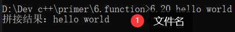

#cpp 2022/7/9
## const形参和实参
- 用实参初始化形参是会忽略掉顶层`const`
- 当形参有顶层const时，传给它常量对象或者非常量对象都是可以的。
```cpp
#include <iostream>
#include <string>
#include <cctype>
using namespace std;
//判断字符串是否全是大写
bool is_all_upper(const string &s)
{
	string::size_type k=0, size = s.size();
	for(string::const_iterator iter=s.begin(); iter != s.end(); ++iter){
		if(*iter == toupper(*iter))
			++k;
	}
	if(k == size)
		return true;
	return false;
}

void func(int i)
{
	cout << ++i << endl;
}
//将字符串全部改为小写
void to_lower(string &s)
{
	string::size_type size = s.size();
	for(string::iterator iter=s.begin(); iter != s.end(); ++iter){
		if(islower(*iter))
			*iter = toupper(*iter);
	}
}

int main()
{
	const int i=0;
	func(i);//1
	cout << i << endl;//0
	
	string s;
	cout << "Enter a string: ";
	cin >> s;
	bool flag = is_all_upper(s);
	if(flag)
		cout << "是全部都是大写！" << endl;
	else
		cout << "不是全部都是大写！" << endl;
	to_lower(s);
	cout << "convert to lower: " << s << endl;
	return 0;
}
```
## 函数参数传递-vector和其它容器类型的形参
- 不要使用普通的非引用vector形参
- 要使用引用形参传递
- 事实上，C++程序员要传递vector的迭代器
1. 顺序容器：vector, list, deque等
2. 关联容器：map, set等
```cpp
#include <iostream>
#include <vector>
using namespace std;

void print(vector<double> v)
{
	vector<double>::iterator iter = v.begin();
	while(iter != v.end()){
		cout << *iter << endl;
		++iter;
	}
}
void print2(vector<double> &v)
{
	for(vector<double>::iterator iter=v.begin(); iter != v.end(); ++iter)
		cout << *iter << endl;
}
void print3(vector<double>::const_iterator beg,
			vector<double>::const_iterator end)//传迭代器 
{
	while(beg != end){
		cout << *beg++;
		if(beg != end) cout << " ";
	}
	cout << endl;
}
double print4(vector<double>::const_iterator beg,
			vector<double>::const_iterator end)
{
	double sum = 0.0;
	while(beg != end){
		sum += *beg++;
	}
//	cout << sum << endl;
	return sum;
}

int main()
{
	vector<double> dvec;
//	dvec.push_back(1.1);
//	dvec.push_back(2.2);
//	dvec.push_back(3.3);
	
//	print(dvec);//	把dvec复制到形参 
//	print2(dvec);//传引用
//	print3(dvec.begin(), dvec.end());//传迭代器
	cout << "Entry some nums:" << endl;
	double num;
	while(cin >> num)
		dvec.push_back(num);
	double res = print4(dvec.begin(), dvec.end());
	cout << "sum of nums is: " << res << endl;
	return 0;
}
```
## 函数参数传递-数组形参
>1. 数组不能复制。无法以值传递的方式使用数组参数
>2. 数组名是指向数组第一个元素的指针

- 三种传递数组的写法
- 形参的长度会引起误解
- 数组实参-数组会悄悄地转换为指针
- 数组是以指针的形式传递给函数的，函数一开始不知道数组的确切尺寸，需要提供额外信息
1. 使用标记指定数组长度：要求数组本身包含一个结束标记。典型示例是C风格字符串，储存在字符数组中，并且在最后一个字符后面跟着一个空字符。
```cpp
void print(const char *cp){
	if(cp)//cp不是空指针
		while(*cp)//指针所指的字符不是空字符
			cout << *cp++;
}
```
2. 使用标准库规范：传递指向数组首元素和尾后元素的指针。
```cpp
void print(const int *beg, const int *end){
	//输出beg到end(不包含end)的所有元素
	while(beg != end)
		cout << *beg++ << endl;
}

int j[2] = {0, 1};
print(begin(j), end(j));
```
3. 显示传递一个表示数组大小的形参

- 通过引用传递数组
- 多维数组地传递
- 传递给函数地数组地处理-三种方法
	- 1
```cpp
#include <iostream>

using namespace std;
void print1(int *x, size_t size)//指向数组的第一个元素，需要把数组大小传进来 
{
	for(size_t i=0; i != size; ++i)
		cout << x[i] << " ";
	cout << endl;
}
void print2(int x[], size_t size)//同上 
{
	for(size_t i=0; i != size; ++i)
		cout << x[i] << " ";
	cout << endl;
}
void print3(int x[10], size_t size)//10没用，写不写不影响 
{
	
}
//int (&x)[10]：x是引用，指向含有10个元素的数组
//int &x[10]：x是数组，含有10个元素都是引用。 
void print4(int (&x)[10])//10必须写，不够灵活 
{
	cout << "传数组的引用:" << endl;
	for(size_t i=0; i != 10; ++i)
		cout << x[i] << " ";
	cout << endl;
}
//多维数组，x是一个指针，指向一个含有rowSize行的数组的第一行，每一行是10个数 
void print5(int (*x)[10], size_t rowSize)
{
	cout << "二维数组：" << endl;
	for(size_t i=0; i != rowSize; ++i){
		for(size_t j=0; j != 10; ++j)
			cout << x[i][j] << " ";
		cout << endl;
	}
}
//传入指向首个元素和末尾元素的指针
void print6(const int *beg, const int *end)
{
	cout << "传首尾元素指针：" << endl;
	while(beg != end)
		cout << *beg++ << " ";
	cout << endl;
 }
//传字符数组(C风格字符串)，最后一个字符是null(\0) 
void print7(const char *x)
{
	cout << "传字符数组/C风格字符串:" << endl;
	while(*x)//检测指针所指内容是否非空，C风格字符串最后一个字符'\0'为空 
		cout << *x++;
	cout << endl;	
} 

int main()
{
	int arr[] = {2, 4, 6, 8, 0, 1, 3, 5, 7, 9};
	print1(arr, 10);
	print2(arr, 10);
	print4(arr);
	print6(arr, arr+10);
	int m[][10] = {
		{1,2,3,4,5,6,7,8,9,10},
		{9,8,7,6,5,4,3,2,1,0},
		{5,8,9,6,3,2,1,4,7,11}
	};
	print5(m, 3);
	
	char x[] = "bruce lee go";
	print7(x);
	return 0;
}
```
## main函数：处理命令行选项
```cpp
//命令行选项
//argc：数组中字符串的数量
//argv：是一个数组，元素是指向C风格字符串的指针
int main(int argc, char **argv)//char *argv[]
{
	...
}
```
- 实参传给main函数之后，argv的第一个元素指向程序的名字或一个空字符串
- 接下来的元素一次传递命令行提供的实参。最后一个指针之后的元素值保证为0
```cpp
#include <iostream>
using namespace std;
//命令行选项：个数 字符串数组，每一个元素是一个字符串 
int main(int argc, char **argv)
{
	cout << argv[0] << endl;//argv[0]不是命令行选项，而是程序名称,本例为6.7 
	cout << argv[1] << endl;
	cout << argv[2] << endl;
	for(int i=0; i<argc; ++i)//使用循环，输出所有参数
		cout << argv[i] << endl;
	
	int start, end, step;
	start = atoi(argv[1]);//将字符串转为数值："123"→123
	end = atoi(argv[2]);
	step = atoi(argv[3]);
	for(int k=start; k<=end; k+=step)
		cout << k << endl;
	return 0;
}
//在程序所在文件夹运行
//...6.7 hello world c++
//输出：6.7 hello world
```
- 例：编写一个`main`函数，令其接受两个实参。把实参的内容连接成一个`string`对象并输出出来。
```cpp
#include <iostream>
#include <string>
using namespace std;
int main(int argc, char **argv)
{
	string s;
	for(int i=1; i != argc; ++i)
		s += string(argv[i]) + " ";//string将C风格字符串转化为字符串，字符串可以和空格" "拼接 
	cout << "拼接结果：" << s << endl;
	return 0;
}
```

## 含有可变形参的函数
为了编写能处理不同数量实参的函数，C++11新标准提供了两种主要的方式：
1. 如果所有实参类型相同，可以传递一个名为`initializer_list`的标准库类型
2. 如果实参类型不同，可以编写一种特殊的函数，也就是所谓的可变参数模板，以后再讨论这种情况
### initializer_list形参
如果函数的实参数量为止但是全部实参的类型都相同，可以使用`initializer_list`类型的实参。`initializer_list`是一种标准库类型，用于表示某种特定类型的值的数组，类型定义在同名的头文件中。

| initializer_list提供的操作       |                                                                               |
| -------------------------------- | ----------------------------------------------------------------------------- |
| initializer_list<> lst;          | 默认初始化：<>内类型的元素的空列表                                            |
| initializer_list<> lst{a,b,b..}; | lst的元素数量和初始值一样多：lst的元素是对应初始值的副本；**列表中的元素永远是const** |
| lst2(lst) or lst2 = lst          | 拷贝或赋值不会拷贝列表中的元素；拷贝后，原始列表和副本共享元素                |
| lst.begin()                      |  返回指向lst首元素的指针                                                                             |
| lst.end()                        |                      返回指向lst尾元素下一位置的指针                                                         |
| lst.size()                       |                                                列表中的元素数量                               |

```cpp
#include <iostream>
#include <string>
#include <initializer_list>

using namespace std;

void error_msg(initializer_list<string> il)
{
	for(initializer_list<string>::iterator beg=il.begin(), end=il.end(); beg != end; ++beg)
		cout << *beg << " ";
	cout << endl;
}

int main()
{
	string expected, actual;
	cout << "Enter two strings:" << endl;
	cin >> expected, actual;
	if(expected != actual)
		error_msg({"functionX", expected, actual});
	else
		error_msg({"functionX", "okay"});
	return 0;
}
```
### 省略符形参
>省略符形参仅用于C和C++通用的类型

- 省略符形参只能出现在形参列表的最后一个位置，它有两种如下形式
```cpp
//
void foo(param_ist, ...);//逗号","可省略
void foo(...);
```