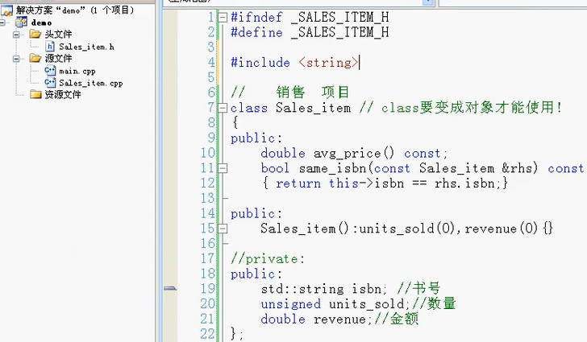

#cpp 2022/7/11
## 内联函数
- 内联函数避免函数调用的开销
- 把内联函数放入头文件
	- 把函数的声明和定义都写在头文件里
- 注意：
	- 内联说明对于编译器来说只是一个建议，编译器可以选择忽略这个建议，递归甘薯、大函数不太可能调用点内联展开。
```cpp
#include <iostream>
using namespace std;
//带有inline的函数:内联函数 
//在编译的时候将内联函数展开，速度更快 
inline int sum(int a, int b)
{
	return a+b;
}

int main()
{
	int x[] = {1,2,3,4,5};
	int y[] = {1,2,3,4,5};
	for(int i=0; i<5; ++i)
		cout << sum(x[i],y[i]) << endl;
	
	return 0;
}
```
## 类的成员函数
- 函数原型必须在类中定义
- 函数体
	- 在类中定义函数体
	- 在类外定义函数体
- this指针
- const成员函数
```cpp
#include <iostream>
using namespace std;
class Sales_item
{
	public:
		bool same_isbn(const Sales_item &rhs) const //常函数，不对数据成员进行修改 
		{
			return this->isbn==rhs.isbn;//this表示当前对象，可以省略 
		}
		
		double avg_prive() const;//函数原型声明 
		
	public:
		std::string isbn;//书号 
		unsigned units_sold;//数量 
		double revenue;
};
//在类的外部定义函数体 
double Sales_item::avg_prive() const//::表示范围解析，函数属于该类 
{
	if(this->units_sold)
		return this->revenue / this->units_sold;
	else
		return 0;
}


int main()
{
	//类		对象 
	Sales_item item1, item2;
	item1.isbn = "0-201-78345-X";
	item1.units_sold = 10;
	item1.revenue = 300.00;
	
	cout << item1.avg_prive() << endl;
	
	item2.isbn = "0-201-78345-X";
	item2.units_sold = 2;
	item2.revenue = 70.00;
	
	cout << item2.avg_prive() << endl;
	
	if(item1.same_isbn(item2))
		cout << "The two books are the same." << endl;
	else
		cout << "Not the same." << endl;
	return 0;
}
```
## 类的构造函数
- 构造函数是特殊的成员函数
	- 与类名相同，不需要返回值
	- **内置基本类型进行初始化，string等类类型会自动进行默认初始化**
- 构造函数的定义
	- 没写构造函数时，C++会自动默认初始化
- 构造函数的初始化列表
- 合成的默认构造函数


```cpp
#include <iostream>
#include <string> 
using namespace std;
//类的构造函数
class Person
{
	public:
		//默认的构造函数，没有参数 
		Person():money(0)//类的构造函数; 初始化列表 
		{
//			money = 0; 
		} 
	public:
		int money;
		
};
class Dog
{
	public:
		int num;
		string name;
}; 
Dog d;//全局对象，基本内置类型会自动初始化 

int main()
{
	Person a, b;//创建对象时，是通过调用person的构造函数创建的 
	
	cout << a.money << endl;
	cout << b.money << endl;
	
	cout << "Hello, 构造函数" << endl << endl;;
	Dog c;//创建局部对象c，基本内置类型不会进行初始化；如果定义静态局部对象，则同全局对象 
	cout << "局部对象：" << endl;
	cout << c.name << endl;
	cout << c.num << endl;//未进行初始化，乱值
	cout << "全局对象："  << endl;
	cout << d.num << endl;
	cout << d.name << endl; 
	return 0;
}
```
p67 2022/7/12
## 重载函数
- **重载函数：出现在相同作用域的两个函数，名字相同形参不同，返回类型相同**
- 好处：不用费心给每一个函数起名字
- 函数重载和重复声明的区别：
	- 错误：形参表不同，返回类型相同
	- 函数不能仅仅基于不同的返回类型而实现重载
- 何时不重载函数名
```cpp
#include <iostream>
#include <vector>
using namespace std;
class Account
{
};
class Phone
{
};
class Name
{
};
class Record
{
	public:
		Account a;
		Phone b;
		Name c;
};

void lookup(const Account &a)
{
	cout << "根据账号查找" << endl;
}
void lookup(const Phone &b)
{
	cout << "根据点好查找" << endl;
}
void lookup(const Name &c)
{
	cout << "根据姓名查找" << endl;
}

void show(int x)
{
	cout << x << endl;
}
void show(vector<int> &v)
{
	for(vector<int>::iterator iter=v.begin();
		iter!=v.end(); ++iter)
		cout << *iter << endl;
}

int main()
{
	Account x;
	Phone y;
	Name z;
	lookup(x);
	lookup(y);
	lookup(z);
	
	int a=89;
	vector<int> b;
	b.push_back(1);
	b.push_back(2);
	b.push_back(3);
	//使用的时候，C++自动识别形参类型调用函数 
	show(a);
	show(b);
	return 0;
}
```
## 重载与作用域
- 变量屏蔽(变量隐藏)
- 函数屏蔽(函数隐藏)而不是函数重载
- 每一个版本的函数重载都应该在用一个作用域中声明
- 注意：局部的声明函数是一种不明智地方法
	- 函数的声明应该放在头文件中
```cpp
#include <iostream>
#include <string>
using namespace std;
string init()
{
	return "Hello";
}
void func()
{
//	int init = 0;//注意：变量名init和上面相同，则将上述函数屏蔽
	string s = init();
	cout << s << endl; 
}
void print(int);
void print(double);
void print(const string &);
void foo()
{
	//发生函数屏蔽
//	void print(int:;//这是一个局部的函数声明，不是函数重载，要在同一个作用域中声明 
	print(3);
	print(3.14);
	print("Hello");
}
int main()
{
	func();
	foo();
	return 0;
}

void print(int x)
{
	cout << x << endl;
}
void print(double y)
{
	cout << y << endl;
}
void print(const string &s)
{
	cout << s << endl;
}
```
## 函数匹配(重载确定)
- 重载确定的三个步骤
	1. 候选函数
	2. 选择可行函数
	3. 寻找最佳匹配(如果有的话)
- 含有多个形参的重载确定
```cpp
#include <iostream>
using namespace std;
void f()
{
	cout << "f()" << endl;
}
void f(int a)
{
	cout << "f(int a)" << endl;
}
void f(int a, int b)
{
	cout << "f(int a, int b)" << endl; 
}
void f(double a, double b=3.14)
{
	cout << "f(double a, double b=3.14)" << endl;
}
void g(int a)
{
	cout << "g(int a)" << endl;
}
int main()
{
	f();//f() 
	f(8);//f(int a)
	f(5.6);//两个可行函数f(int a), f(double a, double b=3.14)最佳匹配
//	f(42, 2.56);//存在二义性，报错
//	f(3.14, 20);//存在二义性 
	f(5, 6);//f(int, int)
	f(3.14, 2.09);//f(double, double)
	return 0;
}
```