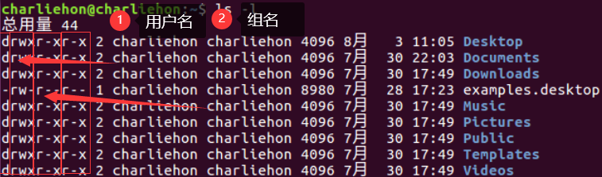
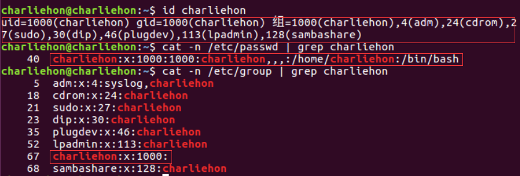
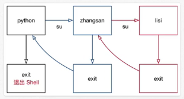

#linux 2022/8/4

## 目标

- 用户 和 权限 的基本概念
- 用户管理 终端命令
- 组管理 终端命令
- 修改权限 终端命令

## 01.用户 和 权限 的基本概念

### 1.1基本概念

- 用户 是Linux系统工作中重要的一环，用户管理包括 **用户** 与 **组管理**
- 在Linux系统中，不论是由本机或是远程登录系统，每个系统都**必须拥有一个账号**，并且**对于不同的系统资源拥有不同的使用权限**
- 在Linux中，可以指定 **每一个用户** 针对 **不同文件或者目录** 的 **不同权限**
- 对 **文件/目录** 的权限包括：

| 序号 | 权限   | 英文   | 缩写 | 数字代号 |
| ---- | ------ | ------ | ---- | -------- |
| 01   | 读     | read   | r    | 4        |
| 02   | 写     | write  | w    | 2        |
| 03   | 执行   | excute | x    | 1        |
| 04   | 无权限 |        | -    | 0         |

 ### 1.2组
- 为了方便用户管理，提出了 **组** 的概念，如下图所示

```linux

--------------------------
|  张三    李四      王五  |
|                        |
|                        |
|         开发组          |
--------------------------

```

- 在实际应用中，可以预先针对 组 设置好权限，然后将**不同的用户添加到对应的组中，从而不用依次为每一个用户设置权限**

### 1.3 ls -l扩展
- `ls -l`可以查看文件夹下文件的详细信息，从左到右依次是：
	- **权限**，第1个字符如果是`d`表示目录，`-`表示文件
		- `r`：可读；`w`：可写；`x`：可执行
		- 第一列三个字母`rwx`表示拥有者权限
		- 第二列表示组权限
		- 第三列表示其它用户权限
	- **硬链接数**，通俗地讲，就是有多少种方式，可以访问目录/文件。如下图种所示的数字1、2，表示达到该目录/文件的链接方式如`cd .`，`cd ..`，绝对路径等
	- **拥有者**，家目录下 文件/目录 的拥有者通常都是当前用户
	- **组**，在Linux种，很多时候，会出现组名和用户名相同的情况
	- **大小**
	- **时间**
	- **名称**



### 1.4 chmod简单使用(重要)

- `chmod`可以修改 **用户/组** 对 **文件/目录** 的权限
- 命令格式如下，`+`表示增加权限，`-`表示删除权限

```linux
$ chmod +/-rwd 文件名|目录
```

>提示：以上方式会一次性修改`拥有者`/`组` 权限

如果要在目录下执行命令，就必须有可执行权限`x`。

### 1.5超级用户

- Linux系统中的`root`账号通常 **用于系统的维护和管理**，对操作系统的所有资源 **具有所有访问权限**
- 在大多数版本的Linux中，都**不推荐直接使用root账户登陆系统**
- 在Linux安装的过程中，系统会自动创建一个用户账号，而这个默认的用户就称为“标准用户”

**sudo**
- `su`是`substitude user`的缩写，表示 **使用另一个用户的身份**
- `sudo`命令用来以其它身份执行命令，预设的身份为`root`
- 用户使用`sudo`时，必须先输入密码，之后有**5分钟的有效期限**，超过期限则必须重新输入密码

>若其未授权的用户企图 使用`sudo`，则会发出警告邮件给管理员

## 02.组管理 终端命令

>提示：**创建组/删除组** 的终端命令都需要通过`sudo`执行

| 序号 | 命令                     | 作用       |
| ---- | ------------------------ | ---------- |
| 01   | `groupadd 组名`          | 添加组     |
| 02   | `groupdel 组名`          | 删除组     |
| 03   | `cat /etc/group`          | 确认组信息 |
| 04   | `chgrp -R 组名 文件/目录名` | 修改文件/目录的所属组           |

>提示：
>- 组信息保存在`/etc/group`文件中
>- `/etc`目录是专门用来保存 **系统配置信息** 的目录

### 演练目标

1. 在`charliehon`用户的桌面文件夹下创建`python学习`目录
2. 新建`dev`组
3. 将`python学习`目录的组修改为`dev`

```linux
# 创建目录 Python学习
$ mkdir Python学习

# 添加组 dev
$ sudo groupadd dev

# 修改目录所属组
$ sudo chgrp -R dev Python学习
```

## 03.用户管理 终端命令

>提示：创建用户/删除用户/修改其它用户密码 的终端命令都需要通过`sudo`执行

### 3.1创建用户/设置密码/删除用户

| 序号 | 命令                               | 作用         | 说明                                                                                       |
| ---- | ---------------------------------- | ------------ | ------------------------------------------------------------------------------------------ |
| 01   | `useradd -m -g 组 新建用户名`       | 添加新用户   | -m 自动建立用户家目录<br>                          -g 指定用户所在组，否则会建立一个和同名的组 |
| 02   | `passwd 用户名`                    | 设置用户密码 | 如果是普通用户，直接用passwd可以修改自己的账户密码                                         |
| 03   | `userdel -r 用户名`                | 删除用户     | -r选项会自动删除用户家目录                                                                 |
| 04   | `cat /etc/passwd 管道 grep 用户名` | 确认用户信息 | 新建用户后，用户信息会保存在`/etc/passwd`                                                  |

>提示：
>- 创建用户时，如果忘记添加 `-m`选项指定新用户的家目录 -- 最简单的方法就是删除用户，重新创建
>- 创建用户时，默认会创建一个和用户名同名的组名
>- 用户信息保存在`/etc/passwd`文件中
>

```linux
# 在 组charliehon 中添加 用户zhangsan
$ sudo useradd -m -g charliehon zhangsan

# 设置用户密码，不设置的话无法通过XShell远程连接
$ sudo passwd zhangsan
# 回车后即可输入密码

# 不使用 -m 添加用户时，不会自动创建家目录，手动删除后重新创建最方便
$ sudo useradd -g charliehon lisi
$ sudo userdel -r lisi
$ sudo useradd -m -g charliehon lisi
```

### 3.2查看用户信息

| 序号 | 命令          | 作用                     |
| ---- | ------------- | ------------------------ |
| 01   | `id [用户名]` | 查看用户 UID 和 GID 信息 |
| 02   | `who`         | 查看当前所有登陆的用户列表                         |
| 03   | `whoami`      |                       查看当前登陆用户的账号名   |

**passwd 文件**
`/etc/passwd`文件存放的是用户的信息，由6个冒号`:`分组成的7个信息，分别是
1. 用户名
2. 密码 (x，表示加密的密码)
3. UID (用户名)
4. GID (组标识)
5. 用户全名或本地账号
6. 家目录
7. 登陆使用的 Shell，就是登陆之后，使用的终端命令，`ubuntu`默认是`dash`



```linux
# 查看 id
$ id charliehon

# 查看 /etc/passwd 下存储信息
$ cat -n /etc/passwd | grep charliehon

# 查看用户所在组信息
$ cat -n /etc/group | grep charliehon
```

**usernod**
- `usermod`可以用来设置 用户 的主组/附加组 和 登陆Shell 命令格式如下：
- 主组：通常在新建用户时指定，在`etc/passwd`的第4列 GID对应的组
- 附加组：在`/etc/group`中最后一列表示该组的用户列表，用户指定 **用户的附加权限**

>提示：设置了用户的附加组之后，需要重新登陆才能生效
>
>下图中，组=1000(charliehon)为主组，后面部分为附加组信息
>
>查看组信息`cat -n /etc/group | grep charliehon`可以得到用户对附加组的权限。


```linux
# 修改用户的主组 (passwd 中的 GID)
$ usermod -g 组 用户名

# 修改用户的附加组
$ usermod -G 组 用户名

# 修改用户登陆 Shell
$ usermod -s /bin/bash
```

>注意：默认使用`useradd`添加的用户是没有权限使用`sudo`以`root`身份执行命令的，可以使用以下命令，将用户添加到`sudo`附加组中

```linux
$ usermod -G sudo 用户名
```

**which(重要)**

>提示
>- `/etc/passwd`是用于保存用户信息的文件
>- `/usr/bin/passwd`是用于修改用户密码的程序

- `which`命令可以查看执行命令所在的位置，例如：

```linux
$ which ls

# 输出
# /bin/ls

$ which useradd

# 输出
# /usr/sbin/useradd
```

**bin 和 sbin**
- 在`Linux`中，绝大多数可执行文件都是保存在`/bin/`,`sbin`,`/usr/bin`,`/usr/sbin`
- `/bin`(`binary`)是二进制可执行文件目录，主要用于具体应用
- `/sbin`(`system binary`)是系统管理员专用的二进制代码存放目录，主要用于系统管理
- `/usr/bin`(`user commands for applications`)后期安装的一些软件
- `/usr/sbin`(`super user commands for application`)超级用户的一些管理程序

>提示：
>- `cd`这个终端命令是内置在系统内核的，没有独立的文件，因此用`which`无法找到`cd`命令的位置

### 3.3切换用户

| 序号 | 命令         | 作用                   | 说明                                    |
| ---- | ------------ | ---------------------- | --------------------------------------- |
| 01   | `su - 用户名` | 切换用户，并且切换目录 | -可以切换到用户家目录，否则保持位置不变 |
| 02   | `exit`       | 退出当前登陆账户                       |                                         |

- `su`不接用户名，可以切换到`root`，但是不推荐使用，因为不安全
- `exit`示意图如下



## 04.修改文件权限

| 序号 | 命令    | 作用       |
| ---- | ------- | ---------- |
| 01   | `chown` | 修改拥有者 |
| 02   | `chgrp` | 修改组           |
| 03   | `chmod` |      修改权限      |

- 命令格式如下：

```linux
# 修改文件 | 目录的拥有者
$ chown 用户名 文件名|目录名

# 递归修改文件 | 目录的组
$ chgrp -R 组名 文件名|目录名

# 递归修改文件权限
$ chmod -R 755 文件名|目录名
```

- `chmod`在设置权限时，可以简单地使用三个数字分别对应 **拥有者/组** 和 **其它**  用户地权限
- 数字代号表示：4表示`r`，2表示`w`，1表示`x`，则用数字相加分别表示拥有者/组/其它用户的权限。比如上面的`755`,表示`rwxr-xr-x`
- 常见数字组合有(`u`表示用户，`g`表示组 ，`o`表示其他)：
	- `777`===>`u=rwx, g=rwx, o=rwx`
	- `755`===>`u=rwx, g=r-x, o=r-x`
	- `644`===>`u=rw-, g=r--, o=r--`

```linux
# 直接修改文件|目录的 读|写|执行 权限，但是不能精确到 拥有者|组|其它
$ chmod +/-rwx 文件名|目录名
```

### chmod 演练目标

1. 将`01.py`的权限修改为`u=rwx, g=r-x, o=r--`
2. 将`123.txt`的权限修改为`u=rw-, g=r--, o=---`
3. 将`test`目录以及目录下的 所有 文件权限修改为`u=rwx, g=rwx, o=r-x`

```linux
$ chmod 754 01.py

$ chmod 640 123.txt

$ chmod -R 775 test
```
