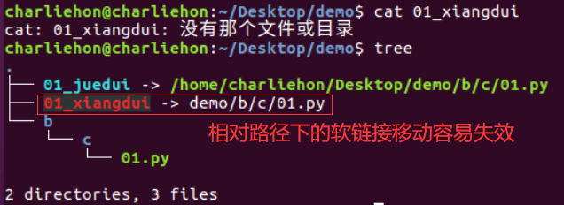
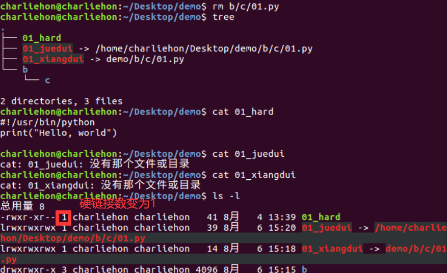
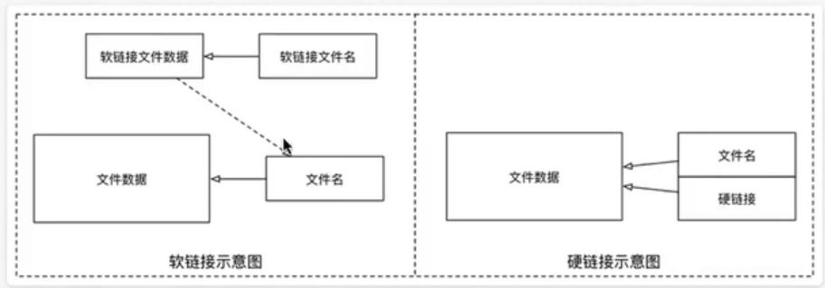

#linux 2022/8/6

# 系统信息相关命令

- 本节内容主要是为了方便通过远程终端维护服务器时，查看服务器上当前 **系统日期和时间 / 磁盘空间占用情况 / 程序执行情况**
- 本小节学习的终端命令基本都是查询命令，通过这些命令对系统资源的使用情况有个了解

## 目标

- 时间和日期
	- `date`
	- `cal`
- 磁盘和目录空间
	- `df`
	- `du`
- 进程信息
	- `ps`
	- `top`
	- `kill`

## 01.时间和日期

| 序号 | 命令   | 作用                               |
| ---- | ------ | ---------------------------------- |
| 01   | `cal`  | calendar查看日历，-y选项可以查看一年的日历 |
| 02   | `date` | 查看系统时间                       |

## 02.磁盘信息

| 序号 | 命令             | 作用                       |
| ---- | ---------------- | -------------------------- |
| 01   | `df -h`          | disk free 显示磁盘剩余空间 |
| 02   | `du -h [目录名]` | disk usage 显示目录下的文件大小                           |

- 说明选项

| 参数 | 含义 |
| ---- | ---- |
| `-h` | 以人性化的方式显示文件大小     |

## 03.进程信息

- 所谓 **进程**，通俗地说就是 **当前正在执行的一个程序**

| 序号 | 命令                 | 作用                              |
| ---- | -------------------- | --------------------------------- |
| 01   | `ps aux`             | process status 查看进程的详细状况 |
| 02   | `top`                | 动态显示运行中的进程并且排序      |
| 03   | `kill [-9] 进程代号` | 终止指定代号的进程，-9表示强行终止                                  |

>`ps`默认只会显示当前用户通过终端启动的应用程序
>
>`PID`表示进程代号
>
>要退出`top`可以直接输入`q`

- `ps`选项功能说明

| 选项 | 含义                                     |
| ---- | ---------------------------------------- |
| `a`  | 显示终端上的所有进程，包括其它用户的进程 |
| `u`  | 显示进程的详细状态                       |
| `x`  | 显示没有控制终端的进程                                         |

>提示：使用`kill`命令时，最好只终止由当前用户开启的进程，而不要终止`root`身份开启的进程，否则可能导致系统崩溃

# 其他命令

## 目标

- 查找文件
	- `find`
- 软连接
	- `ln`
- 打包和压缩
	- `tar`
- 软件安装
	- `apt -get`

## 01.查找文件

- `find`命令功能非常强大，通常用来在 **特定的目录下搜索** 符合条件的文件

| 序号 | 命令                       | 作用 |
| ---- | -------------------------- | ---- |
| 01   | `find [路径] -name "*.py"` | 查找指定路径下扩展名是`.py`的文件，包括子目录     |

- 如果省略路径，表示当前文件夹下查找
- 之前提到的通配符，在使用`find`命令时同时可用

**演练目标**

1. 搜索桌面目录下，文件名包含`1`的文件

```linux
$ find -name "*1*"
```

2. 搜索桌面目录下，所有以`.txt`为扩展名的文件

```linux
$ find -name "*.txt"
```

3. 搜索桌面目录下，以数字`1`开头的文件

```linux
$ find -name "1*"
```

## 02.软链接

| 序号 | 命令                            | 作用 |
| ---- | ------------------------------- | ---- |
| 01   | `ln -s 被链接的源文件 链接文件` | 建立文件的软链接，用通俗的方法讲**类似于Windows下的快捷方式**     |

- 注意：
- 没有`-s`选项建立的是一个 **硬链接文件**
	- 两个文件占用相同大小的硬盘空间，工作中几乎不会建立文件的硬链接
- 源文件要使用绝对路径，不能使用相对路径，这样可以方便移动链接文件后，仍然能够正常使用

**演练目标**

1. 将桌面目录下的`01.py`  **移动** 到`demo/b/c`目录下

```linux
$ mv 01.py demo/b/c
```

2. 在桌面目录下新建的`01.py`的 **软链接** `FirstPython`
	- 分别使用 **相对路径** 和 **绝对路径** 建立 `FirstPython`的软链接

```linux
# 使用相对路径
charliehon@charliehon:~/Desktop$ ln -s demo/b/c/01.py 01xiang_dui

# 使用绝对路径
charlihon@charliehon:~/Desktop$ lb -s /home/charlihon/Desktop/demo/b/c/01.py 01_juedui
```

3. 将`FirstPython`  **移动** 到`demo`目录下，对比使用 **相对路径** 和 **绝对路径** 的区别

```linux
# 通过通配符将两个软链接移动到 demo 文件夹下
$  mv 01* demo
```



## 硬链接简介(知道)

p92

- 在使用`ln`创建链接时，如果没有`-s`选项，会创建一个**硬链接**，而不是软链接。将源文件删除时不影响硬链接文件。

**硬链接演练**

1. 在`~/Desktop/demo`目录下建立`~/Desktop/demo/b/c/01.py`的硬链接`01_hard`

```linux
$ ln /home/charliehon/Desktop/demo/b/c/01.py 01_hard
```

2. 使用`ls -l`查看文件的硬链接数(硬链接--有多少种方式可以访问文件或者目录)
3. 删除`~/Desktop/demo/b/c/01.py`，并且使用`tree`来确认`demo`目录下的三个链接文件

```linux
charliehon@charliehon:~/Desktop/demo$ rm b/c/01.py
```



**文件软硬链接的示意图**



>在Linux中，**文件名** 和 **文件的数据** 是分开存储的

- 提示：
	- 在Linux中，只有文件的`硬连接数 == 0`才会被删除
	- 使用`ls -l`可以查看一个文件的硬链接的数量
	- 在日常工作中，几乎不会建立文件的硬链接，知道即可
